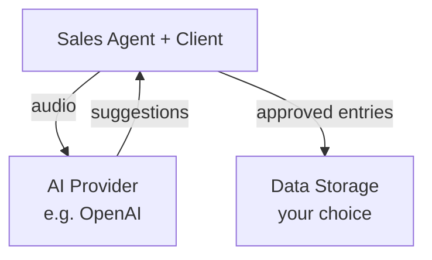

# Data Security & Privacy

How your data flows through FormFlow AI.

---

## Overview

FormFlow AI is designed with flexibility in mind. You control where your data lives and how it's processed.

---

## How Data Flows

### During a conversation

A typical session looks like this:

1. **Sales agent and client** are in the same room (or on a call)
2. **Agent has FormFlow AI open** in their browser on phone or computer
3. **Audio from the conversation** is sent to the AI provider (e.g., OpenAI Realtime API) for processing
4. **The AI returns** suggested form entries in real-time
5. **Agent reviews and approves** entries before they're saved

### After the conversation

Completed form data is saved to your chosen destination:

| Option                 | Where data lives                    | Who manages it                          |
| ---------------------- | ----------------------------------- | --------------------------------------- |
| **Hosted plan**        | FormFlow AI servers                 | We handle security, backups, compliance |
| **Self-hosted**        | Your own servers                    | You maintain full control               |
| **Third-party export** | Google Sheets, Salesforce, your CRM | Governed by that provider's policies    |

---

## Hosting Options

### Hosted Plan (Paid)

- Data stored on our secure servers
- We handle encryption, backups, and access controls
- Suitable for teams who want a managed experience

### Self-Hosted (Open Source)

FormFlow AI is open source. You can:

- Deploy on your own infrastructure
- Keep all data within your network
- Meet internal compliance requirements
- Integrate with existing security policies

---

## AI Provider Data Handling

During conversations, audio is processed by AI providers (currently OpenAI Realtime API). This means:

- Audio is transmitted to OpenAI's servers for real-time processing
- OpenAI's data handling policies apply during processing
- We do not store audio recordings ourselves

For details on OpenAI's data practices, see: [OpenAI API Data Usage Policies](https://openai.com/policies/api-data-usage-policies)

---

## For China-Based Customers

If you're operating in China or serving Chinese customers, you may have concerns about cross-border data transfers.

**Options available:**

- **Self-hosted deployment** within China
- **China-region AI providers** (contact us for supported options)
- **Data residency configurations** to keep data within approved boundaries

[Contact us](#) to discuss your specific compliance requirements.

---

## Questions?

See our [FAQ](/faq) for common questions about data privacy, or [contact us](#) directly.
